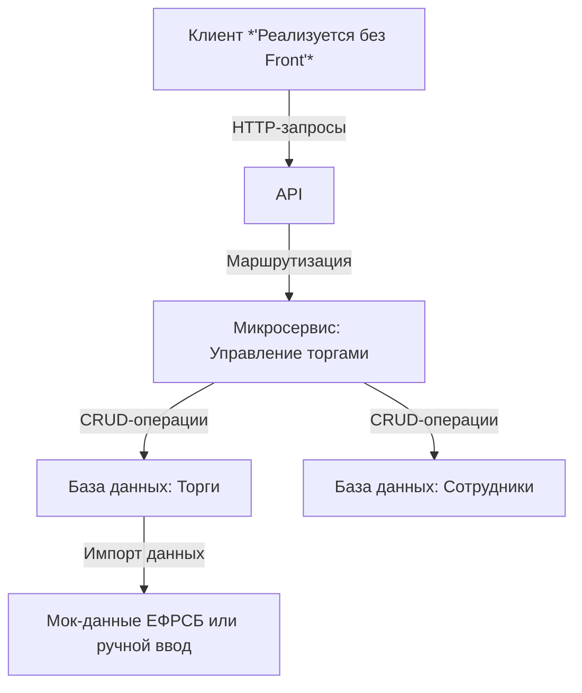

Лабораторные работы АМРС, Масюченко Степан, А-05м-24.
=======
# Техническая документация: Микросервис для управления торгами юридического отдела (ЕФРСБ)

## Введение
#### Цель и назначение продукта
Микросервис предназначен для упрощения работы юридического отдела с торгами на ЕФРСБ. Он позволяет отслеживать актуальные торги, назначать ответственных сотрудников, следить за текущим состоянием и этапом торгов. 

#### Область применения
Данная тематика актуальна, на данный момент такие процессы во многих отделах происходят на excel или физических носителях. Область применения - любой отдел банка, который работает с любом из видов имущества.

*P.S. Данная работа не подрузамевает работу с действующем API ЕФРСБ (он платный), подразумевается работа с искуственными данным. Так же стоит учесть отсутствие у меня, как студента юридического образование, вследствии чего некоторые юридические процессы могут быть отражены не так как они происходят на самом деле.*

## Архетектура продукта
#### Взаимодействие с клиентом и базой



#### Описание базы данных и её структуры

##### Таблица: trades (Торги)

| Поле          | Тип      | Описание                         |
|---------------|----------|----------------------------------|
| id            | SERIAL PRIMARY KEY     | Уникальный идентификатор          |
| trade_number         | TEXT     | Номер торгов                |
| title         | TEXT     | Название торгов                |
| description   | TEXT     | Описание                         |
| start_date    | DATE     | Дата начала подачи заявок                    |
| end_date      | DATE     | Дата окончания подачи заявок                    |
| status        | TEXT | Статус (interesting, applied, purchased, not purchased) |
| responsible_id | INT FOREIGN KEY| ID ответственного сотрудника     |

---

##### Таблица: employees (Сотрудники)

| Поле        | Тип      | Описание               |
|-------------|----------|------------------------|
| id          | SERIAL PRIMARY KEY      | Уникальный идентификатор|
| FIO        | TEXT | Имя сотрудника         |
| position    | TEXT | Должность              |

## Описание API
```json
{
  "openapi": "3.1.0",
  "info": {
    "title": "FastAPI",
    "version": "0.1.0"
  },
  "paths": {
    "/": {
      "get": {
        "summary": "Read Root",
        "operationId": "read_root__get",
        "responses": {
          "200": {
            "description": "Successful Response",
            "content": {
              "application/json": {
                "schema": {

                }
              }
            }
          }
        }
      }
    },
    "/employees": {
      "get": {
        "summary": "Получить всех сотрудников",
        "description": "Возвращает список всех сотрудников.",
        "operationId": "get_employees_employees_get",
        "responses": {
          "200": {
            "description": "Successful Response",
            "content": {
              "application/json": {
                "schema": {
                  "items": {
                    "$ref": "#/components/schemas/Employee"
                  },
                  "type": "array",
                  "title": "Response Get Employees Employees Get"
                }
              }
            }
          }
        }
      },
      "post": {
        "summary": "Добавить нового сотрудника",
        "description": "Создает нового сотрудника и возвращает его данные.",
        "operationId": "create_employee_employees_post",
        "requestBody": {
          "content": {
            "application/json": {
              "schema": {
                "$ref": "#/components/schemas/EmployeeCreate"
              }
            }
          },
          "required": true
        },
        "responses": {
          "200": {
            "description": "Successful Response",
            "content": {
              "application/json": {
                "schema": {
                  "$ref": "#/components/schemas/Employee"
                }
              }
            }
          },
          "422": {
            "description": "Validation Error",
            "content": {
              "application/json": {
                "schema": {
                  "$ref": "#/components/schemas/HTTPValidationError"
                }
              }
            }
          }
        }
      }
    },
    "/employees/{employee_id}": {
      "get": {
        "summary": "Получить сотрудника по ID",
        "description": "Возвращает данные сотрудника по его ID.",
        "operationId": "get_employee_employees__employee_id__get",
        "parameters": [
          {
            "name": "employee_id",
            "in": "path",
            "required": true,
            "schema": {
              "type": "integer",
              "description": "ID сотрудника",
              "title": "Employee Id"
            },
            "description": "ID сотрудника"
          }
        ],
        "responses": {
          "200": {
            "description": "Successful Response",
            "content": {
              "application/json": {
                "schema": {
                  "$ref": "#/components/schemas/Employee"
                }
              }
            }
          },
          "422": {
            "description": "Validation Error",
            "content": {
              "application/json": {
                "schema": {
                  "$ref": "#/components/schemas/HTTPValidationError"
                }
              }
            }
          }
        }
      },
      "put": {
        "summary": "Обновить данные сотрудника",
        "description": "Обновляет данные сотрудника по его ID.",
        "operationId": "update_employee_employees__employee_id__put",
        "parameters": [
          {
            "name": "employee_id",
            "in": "path",
            "required": true,
            "schema": {
              "type": "integer",
              "title": "Employee Id"
            }
          }
        ],
        "requestBody": {
          "required": true,
          "content": {
            "application/json": {
              "schema": {
                "$ref": "#/components/schemas/EmployeeCreate"
              }
            }
          }
        },
        "responses": {
          "200": {
            "description": "Successful Response",
            "content": {
              "application/json": {
                "schema": {
                  "$ref": "#/components/schemas/Employee"
                }
              }
            }
          },
          "422": {
            "description": "Validation Error",
            "content": {
              "application/json": {
                "schema": {
                  "$ref": "#/components/schemas/HTTPValidationError"
                }
              }
            }
          }
        }
      },
      "delete": {
        "summary": "Удалить сотрудника",
        "description": "Удаляет сотрудника по его ID.",
        "operationId": "delete_employee_employees__employee_id__delete",
        "parameters": [
          {
            "name": "employee_id",
            "in": "path",
            "required": true,
            "schema": {
              "type": "integer",
              "title": "Employee Id"
            }
          }
        ],
        "responses": {
          "200": {
            "description": "Successful Response",
            "content": {
              "application/json": {
                "schema": {

                }
              }
            }
          },
          "422": {
            "description": "Validation Error",
            "content": {
              "application/json": {
                "schema": {
                  "$ref": "#/components/schemas/HTTPValidationError"
                }
              }
            }
          }
        }
      }
    },
    "/trades": {
      "get": {
        "summary": "Получить все торги",
        "description": "Возвращает список всех торгов.",
        "operationId": "get_trades_trades_get",
        "responses": {
          "200": {
            "description": "Successful Response",
            "content": {
              "application/json": {
                "schema": {
                  "items": {
                    "$ref": "#/components/schemas/Trade"
                  },
                  "type": "array",
                  "title": "Response Get Trades Trades Get"
                }
              }
            }
          }
        }
      },
      "post": {
        "summary": "Добавить новые торги",
        "description": "Создает новые торги и возвращает их данные.",
        "operationId": "create_trade_trades_post",
        "requestBody": {
          "content": {
            "application/json": {
              "schema": {
                "$ref": "#/components/schemas/TradeCreate"
              }
            }
          },
          "required": true
        },
        "responses": {
          "200": {
            "description": "Successful Response",
            "content": {
              "application/json": {
                "schema": {
                  "$ref": "#/components/schemas/Trade"
                }
              }
            }
          },
          "422": {
            "description": "Validation Error",
            "content": {
              "application/json": {
                "schema": {
                  "$ref": "#/components/schemas/HTTPValidationError"
                }
              }
            }
          }
        }
      }
    },
    "/trades/by_status": {
      "get": {
        "summary": "Получить торги по статусу",
        "description": "Возвращает список торгов с указанным статусом.",
        "operationId": "get_trades_by_status_trades_by_status_get",
        "parameters": [
          {
            "name": "status",
            "in": "query",
            "required": true,
            "schema": {
              "$ref": "#/components/schemas/TradeStatus",
              "description": "Статус торгов"
            },
            "description": "Статус торгов"
          }
        ],
        "responses": {
          "200": {
            "description": "Successful Response",
            "content": {
              "application/json": {
                "schema": {
                  "type": "array",
                  "items": {
                    "$ref": "#/components/schemas/Trade"
                  },
                  "title": "Response Get Trades By Status Trades By Status Get"
                }
              }
            }
          },
          "422": {
            "description": "Validation Error",
            "content": {
              "application/json": {
                "schema": {
                  "$ref": "#/components/schemas/HTTPValidationError"
                }
              }
            }
          }
        }
      }
    },
    "/trades/by_responsible_fio": {
      "get": {
        "summary": "Получить торги по ФИО ответственного",
        "description": "Возвращает список торгов, где указанный сотрудник является ответственным.",
        "operationId": "get_trades_by_responsible_fio_trades_by_responsible_fio_get",
        "parameters": [
          {
            "name": "fio",
            "in": "query",
            "required": true,
            "schema": {
              "type": "string",
              "description": "ФИО ответственного сотрудника",
              "title": "Fio"
            },
            "description": "ФИО ответственного сотрудника"
          }
        ],
        "responses": {
          "200": {
            "description": "Successful Response",
            "content": {
              "application/json": {
                "schema": {
                  "type": "array",
                  "items": {
                    "$ref": "#/components/schemas/Trade"
                  },
                  "title": "Response Get Trades By Responsible Fio Trades By Responsible Fio Get"
                }
              }
            }
          },
          "422": {
            "description": "Validation Error",
            "content": {
              "application/json": {
                "schema": {
                  "$ref": "#/components/schemas/HTTPValidationError"
                }
              }
            }
          }
        }
      }
    },
    "/trades/{trade_id}/new_status": {
      "patch": {
        "summary": "Изменить статус торгов",
        "description": "Обновляет статус торгов по их ID.",
        "operationId": "update_trade_status_trades__trade_id__new_status_patch",
        "parameters": [
          {
            "name": "trade_id",
            "in": "path",
            "required": true,
            "schema": {
              "type": "integer",
              "exclusiveMinimum": 0,
              "description": "ID торгов",
              "title": "Trade Id"
            },
            "description": "ID торгов"
          },
          {
            "name": "status",
            "in": "query",
            "required": true,
            "schema": {
              "$ref": "#/components/schemas/TradeStatus",
              "description": "Статус торгов"
            },
            "description": "Статус торгов"
          }
        ],
        "responses": {
          "200": {
            "description": "Successful Response",
            "content": {
              "application/json": {
                "schema": {
                  "$ref": "#/components/schemas/Trade"
                }
              }
            }
          },
          "422": {
            "description": "Validation Error",
            "content": {
              "application/json": {
                "schema": {
                  "$ref": "#/components/schemas/HTTPValidationError"
                }
              }
            }
          }
        }
      }
    }
  },
  "components": {
    "schemas": {
      "Employee": {
        "properties": {
          "id": {
            "type": "integer",
            "title": "Id"
          },
          "FIO": {
            "type": "string",
            "title": "Fio"
          },
          "position": {
            "type": "string",
            "title": "Position"
          }
        },
        "type": "object",
        "required": [
          "id",
          "FIO",
          "position"
        ],
        "title": "Employee"
      },
      "EmployeeCreate": {
        "properties": {
          "FIO": {
            "type": "string",
            "title": "Fio"
          },
          "position": {
            "type": "string",
            "title": "Position"
          }
        },
        "type": "object",
        "required": [
          "FIO",
          "position"
        ],
        "title": "EmployeeCreate"
      },
      "HTTPValidationError": {
        "properties": {
          "detail": {
            "items": {
              "$ref": "#/components/schemas/ValidationError"
            },
            "type": "array",
            "title": "Detail"
          }
        },
        "type": "object",
        "title": "HTTPValidationError"
      },
      "Trade": {
        "properties": {
          "id": {
            "type": "integer",
            "title": "Id"
          },
          "trade_number": {
            "type": "string",
            "title": "Trade Number"
          },
          "title": {
            "type": "string",
            "title": "Title"
          },
          "description": {
            "type": "string",
            "title": "Description"
          },
          "start_date": {
            "type": "string",
            "format": "date-time",
            "title": "Start Date"
          },
          "end_date": {
            "type": "string",
            "format": "date-time",
            "title": "End Date"
          },
          "status": {
            "type": "string",
            "title": "Status"
          },
          "responsible_id": {
            "type": "integer",
            "title": "Responsible Id"
          }
        },
        "type": "object",
        "required": [
          "id",
          "trade_number",
          "title",
          "description",
          "start_date",
          "end_date",
          "status",
          "responsible_id"
        ],
        "title": "Trade"
      },
      "TradeCreate": {
        "properties": {
          "title": {
            "type": "string",
            "title": "Title"
          },
          "trade_number": {
            "type": "string",
            "title": "Trade Number"
          },
          "description": {
            "type": "string",
            "title": "Description"
          },
          "start_date": {
            "type": "string",
            "format": "date-time",
            "title": "Start Date"
          },
          "end_date": {
            "type": "string",
            "format": "date-time",
            "title": "End Date"
          },
          "status": {
            "type": "string",
            "title": "Status"
          },
          "responsible_id": {
            "type": "integer",
            "title": "Responsible Id"
          }
        },
        "type": "object",
        "required": [
          "title",
          "trade_number",
          "description",
          "start_date",
          "end_date",
          "status",
          "responsible_id"
        ],
        "title": "TradeCreate"
      },
      "TradeStatus": {
        "type": "string",
        "enum": [
          "active",
          "applied",
          "purchased",
          "not purchased"
        ],
        "title": "TradeStatus"
      },
      "ValidationError": {
        "properties": {
          "loc": {
            "items": {
              "anyOf": [
                {
                  "type": "string"
                },
                {
                  "type": "integer"
                }
              ]
            },
            "type": "array",
            "title": "Location"
          },
          "msg": {
            "type": "string",
            "title": "Message"
          },
          "type": {
            "type": "string",
            "title": "Error Type"
          }
        },
        "type": "object",
        "required": [
          "loc",
          "msg",
          "type"
        ],
        "title": "ValidationError"
      }
    }
  }
}
```

## Выбор стека технологий
#### Стэк
Язык программирования : *python*.

*Обоснование : т.к. я являюсь python разработчиком, выбираю именно этот язык*

Фреймворк : *FastAPI*

*Обоснование : на данный момент самый удобный по моему мнению фреймворк для создания микросервиса, не просто так он называется "быстрый api".* 😁 *Из плюсов : автоматическое создание документации (встроенный swagger), удобные FRONT для чтения документации*

СУБД : *PostgreSQL*

*Обоснование : слоник наше всё, куча различных фитч и удобный софт для администрирования и анализа*

#### Докер
```
FROM python:3.9-slim
WORKDIR /app
COPY requirements.txt .
RUN pip install --no-cache-dir -r requirements.txt
COPY . .
EXPOSE 8000
CMD ["uvicorn", "main:app", "--host", "0.0.0.0", "--port", "8000"]
```
При самой разработке используется инструмент изоляции окружения venv.

*P.S. Спецификация API, и весь код могут поменяться во время разработки, на данном этапе предоставлены основные ключевые моменты, которых я постараюсь придерживаться. Изменения будут вносится в документацию.*
