<<<<<<< HEAD
# masyuchenko_amrs_mag_1_kurs_a_05m_24
Лабораторные работы АМРС, Масюченко Степан, А-05м-24
=======
# Техническая документация: Микросервис для управления торгами юридического отдела (ЕФРСБ)

## Введение
#### Цель и назначение продукта
Микросервис предназначен для упрощения работы юридического отдела с торгами на ЕФРСБ. Он позволяет отслеживать актуальные торги, назначать ответственных сотрудников, следить за текущим состоянием и этапом торгов. 

#### Область применения
Данная тематика актуальна, на данный момент такие процессы во многих отделах происходят на excel или физических носителях. Область применения - любой отдел банка, который работает с любом из видов имущества.

*P.S. Данная работа не подрузамевает работу с действующем API ЕФРСБ (он платный), подразумевается работа с искуственными данным. Так же стоит учесть отсутствие у меня, как студента юридического образование, вследствии чего некоторые юридические процессы могут быть отражены не так как они происходят на самом деле.*

## Архетектура продукта
#### Взаимодействие с клиентом и базой

```mermaid
graph TD
    A[Клиент *'Реализуется без Front'*] -->|HTTP-запросы| B[API]
    B -->|Маршрутизация| C[Микросервис: Управление торгами]
    C -->|CRUD-операции| D[База данных: Торги]
    C -->|CRUD-операции| E[База данных: Сотрудники]
    D -->|Импорт данных| F[Мок-данные ЕФРСБ или ручной ввод]
```



#### Описание базы данных и её структуры

##### Таблица: trades (Торги)

| Поле          | Тип      | Описание                         |
|---------------|----------|----------------------------------|
| id            | SERIAL PRIMARY KEY     | Уникальный идентификатор          |
| title         | TEXT     | Название торгов                |
| description   | TEXT     | Описание                         |
| start_date    | DATE     | Дата начала подачи заявок                    |
| end_date      | DATE     | Дата окончания подачи заявок                    |
| status        | TEXT | Статус (interesting, applied, purchased, not purchased) |
| responsible_id | INT FOREIGN KEY| ID ответственного сотрудника     |

---

##### Таблица: employees (Сотрудники)

| Поле        | Тип      | Описание               |
|-------------|----------|------------------------|
| id          | SERIAL PRIMARY KEY      | Уникальный идентификатор|
| FIO        | TEXT | Имя сотрудника         |
| position    | TEXT | Должность              |

## Описание API
```json
{
    "openapi": "3.1.0",
    "info": {
        "title": "FastAPI",
        "version": "0.1.0"
    },
    "paths": {
        "/employees": {
            "get": {
                "summary": "Получить всех сотрудников",
                "description": "Возвращает список всех сотрудников.",
                "operationId": "get_employees_employees_get",
                "responses": {
                    "200": {
                        "description": "Successful Response",
                        "content": {
                            "application/json": {
                                "schema": {
                                    "items": {
                                        "$ref": "#/components/schemas/Employee"
                                    },
                                    "type": "array",
                                    "title": "Response Get Employees Employees Get"
                                }
                            }
                        }
                    }
                }
            },
            "post": {
                "summary": "Добавить нового сотрудника",
                "description": "Создает нового сотрудника и возвращает его данные.",
                "operationId": "create_employee_employees_post",
                "requestBody": {
                    "content": {
                        "application/json": {
                            "schema": {
                                "$ref": "#/components/schemas/EmployeeCreate"
                            }
                        }
                    },
                    "required": true
                },
                "responses": {
                    "200": {
                        "description": "Successful Response",
                        "content": {
                            "application/json": {
                                "schema": {
                                    "$ref": "#/components/schemas/Employee"
                                }
                            }
                        }
                    },
                    "422": {
                        "description": "Validation Error",
                        "content": {
                            "application/json": {
                                "schema": {
                                    "$ref": "#/components/schemas/HTTPValidationError"
                                }
                            }
                        }
                    }
                }
            }
        },
        "/employees/{employee_id}": {
            "get": {
                "summary": "Получить сотрудника по ID",
                "description": "Возвращает данные сотрудника по его ID.",
                "operationId": "get_employee_employees__employee_id__get",
                "parameters": [
                    {
                        "name": "employee_id",
                        "in": "path",
                        "required": true,
                        "schema": {
                            "type": "integer",
                            "description": "ID сотрудника",
                            "title": "Employee Id"
                        },
                        "description": "ID сотрудника"
                    }
                ],
                "responses": {
                    "200": {
                        "description": "Successful Response",
                        "content": {
                            "application/json": {
                                "schema": {
                                    "$ref": "#/components/schemas/Employee"
                                }
                            }
                        }
                    },
                    "422": {
                        "description": "Validation Error",
                        "content": {
                            "application/json": {
                                "schema": {
                                    "$ref": "#/components/schemas/HTTPValidationError"
                                }
                            }
                        }
                    }
                }
            },
            "put": {
                "summary": "Обновить данные сотрудника",
                "description": "Обновляет данные сотрудника по его ID.",
                "operationId": "update_employee_employees__employee_id__put",
                "parameters": [
                    {
                        "name": "employee_id",
                        "in": "path",
                        "required": true,
                        "schema": {
                            "type": "integer",
                            "title": "Employee Id"
                        }
                    }
                ],
                "requestBody": {
                    "required": true,
                    "content": {
                        "application/json": {
                            "schema": {
                                "$ref": "#/components/schemas/EmployeeCreate"
                            }
                        }
                    }
                },
                "responses": {
                    "200": {
                        "description": "Successful Response",
                        "content": {
                            "application/json": {
                                "schema": {
                                    "$ref": "#/components/schemas/Employee"
                                }
                            }
                        }
                    },
                    "422": {
                        "description": "Validation Error",
                        "content": {
                            "application/json": {
                                "schema": {
                                    "$ref": "#/components/schemas/HTTPValidationError"
                                }
                            }
                        }
                    }
                }
            },
            "delete": {
                "summary": "Удалить сотрудника",
                "description": "Удаляет сотрудника по его ID.",
                "operationId": "delete_employee_employees__employee_id__delete",
                "parameters": [
                    {
                        "name": "employee_id",
                        "in": "path",
                        "required": true,
                        "schema": {
                            "type": "integer",
                            "title": "Employee Id"
                        }
                    }
                ],
                "responses": {
                    "200": {
                        "description": "Successful Response",
                        "content": {
                            "application/json": {
                                "schema": {}
                            }
                        }
                    },
                    "422": {
                        "description": "Validation Error",
                        "content": {
                            "application/json": {
                                "schema": {
                                    "$ref": "#/components/schemas/HTTPValidationError"
                                }
                            }
                        }
                    }
                }
            }
        },
        "/trades": {
            "get": {
                "summary": "Получить все торги",
                "description": "Возвращает список всех торгов.",
                "operationId": "get_trades_trades_get",
                "responses": {
                    "200": {
                        "description": "Successful Response",
                        "content": {
                            "application/json": {
                                "schema": {
                                    "items": {
                                        "$ref": "#/components/schemas/Trade"
                                    },
                                    "type": "array",
                                    "title": "Response Get Trades Trades Get"
                                }
                            }
                        }
                    }
                }
            },
            "post": {
                "summary": "Добавить новые торги",
                "description": "Создает новые торги и возвращает их данные.",
                "operationId": "create_trade_trades_post",
                "requestBody": {
                    "content": {
                        "application/json": {
                            "schema": {
                                "$ref": "#/components/schemas/TradeCreate"
                            }
                        }
                    },
                    "required": true
                },
                "responses": {
                    "200": {
                        "description": "Successful Response",
                        "content": {
                            "application/json": {
                                "schema": {
                                    "$ref": "#/components/schemas/Trade"
                                }
                            }
                        }
                    },
                    "422": {
                        "description": "Validation Error",
                        "content": {
                            "application/json": {
                                "schema": {
                                    "$ref": "#/components/schemas/HTTPValidationError"
                                }
                            }
                        }
                    }
                }
            }
        },
        "/trades/by_status": {
            "get": {
                "summary": "Получить торги по статусу",
                "description": "Возвращает список торгов с указанным статусом.",
                "operationId": "get_trades_by_status_trades_by_status_get",
                "parameters": [
                    {
                        "name": "status",
                        "in": "query",
                        "required": true,
                        "schema": {
                            "$ref": "#/components/schemas/TradeStatus",
                            "description": "Статус торгов"
                        },
                        "description": "Статус торгов"
                    }
                ],
                "responses": {
                    "200": {
                        "description": "Successful Response",
                        "content": {
                            "application/json": {
                                "schema": {
                                    "type": "array",
                                    "items": {
                                        "$ref": "#/components/schemas/Trade"
                                    },
                                    "title": "Response Get Trades By Status Trades By Status Get"
                                }
                            }
                        }
                    },
                    "422": {
                        "description": "Validation Error",
                        "content": {
                            "application/json": {
                                "schema": {
                                    "$ref": "#/components/schemas/HTTPValidationError"
                                }
                            }
                        }
                    }
                }
            }
        },
        "/trades/by_responsible_fio": {
            "get": {
                "summary": "Получить торги по ФИО ответственного",
                "description": "Возвращает список торгов, где указанный сотрудник является ответственным.",
                "operationId": "get_trades_by_responsible_fio_trades_by_responsible_fio_get",
                "parameters": [
                    {
                        "name": "fio",
                        "in": "query",
                        "required": true,
                        "schema": {
                            "type": "string",
                            "description": "ФИО ответственного сотрудника",
                            "title": "Fio"
                        },
                        "description": "ФИО ответственного сотрудника"
                    }
                ],
                "responses": {
                    "200": {
                        "description": "Successful Response",
                        "content": {
                            "application/json": {
                                "schema": {
                                    "type": "array",
                                    "items": {
                                        "$ref": "#/components/schemas/Trade"
                                    },
                                    "title": "Response Get Trades By Responsible Fio Trades By Responsible Fio Get"
                                }
                            }
                        }
                    },
                    "422": {
                        "description": "Validation Error",
                        "content": {
                            "application/json": {
                                "schema": {
                                    "$ref": "#/components/schemas/HTTPValidationError"
                                }
                            }
                        }
                    }
                }
            }
        },
        "/trades/{trade_id}/status": {
            "patch": {
                "summary": "Изменить статус торгов",
                "description": "Обновляет статус торгов по их ID.",
                "operationId": "update_trade_status_trades__trade_id__status_patch",
                "parameters": [
                    {
                        "name": "trade_id",
                        "in": "path",
                        "required": true,
                        "schema": {
                            "type": "integer",
                            "exclusiveMinimum": 0,
                            "description": "ID торгов",
                            "title": "Trade Id"
                        },
                        "description": "ID торгов"
                    }
                ],
                "requestBody": {
                    "content": {
                        "application/json": {
                            "schema": {
                                "$ref": "#/components/schemas/TradeStatusUpdate"
                            }
                        }
                    }
                },
                "responses": {
                    "200": {
                        "description": "Successful Response",
                        "content": {
                            "application/json": {
                                "schema": {
                                    "$ref": "#/components/schemas/Trade"
                                }
                            }
                        }
                    },
                    "422": {
                        "description": "Validation Error",
                        "content": {
                            "application/json": {
                                "schema": {
                                    "$ref": "#/components/schemas/HTTPValidationError"
                                }
                            }
                        }
                    }
                }
            }
        }
    },
    "components": {
        "schemas": {
            "Employee": {
                "properties": {
                    "id": {
                        "type": "integer",
                        "title": "Id"
                    },
                    "FIO": {
                        "type": "string",
                        "title": "Fio"
                    },
                    "position": {
                        "type": "string",
                        "title": "Position"
                    }
                },
                "type": "object",
                "required": [
                    "id",
                    "FIO",
                    "position"
                ],
                "title": "Employee"
            },
            "EmployeeCreate": {
                "properties": {
                    "FIO": {
                        "type": "string",
                        "title": "Fio"
                    },
                    "position": {
                        "type": "string",
                        "title": "Position"
                    }
                },
                "type": "object",
                "required": [
                    "FIO",
                    "position"
                ],
                "title": "EmployeeCreate"
            },
            "HTTPValidationError": {
                "properties": {
                    "detail": {
                        "items": {
                            "$ref": "#/components/schemas/ValidationError"
                        },
                        "type": "array",
                        "title": "Detail"
                    }
                },
                "type": "object",
                "title": "HTTPValidationError"
            },
            "Trade": {
                "properties": {
                    "id": {
                        "type": "integer",
                        "title": "Id"
                    },
                    "title": {
                        "type": "string",
                        "title": "Title"
                    },
                    "description": {
                        "type": "string",
                        "title": "Description"
                    },
                    "start_date": {
                        "type": "string",
                        "format": "date",
                        "title": "Start Date"
                    },
                    "end_date": {
                        "type": "string",
                        "format": "date",
                        "title": "End Date"
                    },
                    "status": {
                        "type": "string",
                        "title": "Status"
                    },
                    "responsible_id": {
                        "type": "integer",
                        "title": "Responsible Id"
                    }
                },
                "type": "object",
                "required": [
                    "id",
                    "title",
                    "description",
                    "start_date",
                    "end_date",
                    "status",
                    "responsible_id"
                ],
                "title": "Trade"
            },
            "TradeCreate": {
                "properties": {
                    "title": {
                        "type": "string",
                        "title": "Title"
                    },
                    "description": {
                        "type": "string",
                        "title": "Description"
                    },
                    "start_date": {
                        "type": "string",
                        "format": "date",
                        "title": "Start Date"
                    },
                    "end_date": {
                        "type": "string",
                        "format": "date",
                        "title": "End Date"
                    },
                    "status": {
                        "type": "string",
                        "title": "Status"
                    },
                    "responsible_id": {
                        "type": "integer",
                        "title": "Responsible Id"
                    }
                },
                "type": "object",
                "required": [
                    "title",
                    "description",
                    "start_date",
                    "end_date",
                    "status",
                    "responsible_id"
                ],
                "title": "TradeCreate"
            },
            "TradeStatus": {
                "type": "string",
                "enum": [
                    "interesting",
                    "applied",
                    "purchased",
                    "not purchased"
                ],
                "title": "TradeStatus"
            },
            "TradeStatusUpdate": {
                "properties": {
                    "status": {
                        "$ref": "#/components/schemas/TradeStatus"
                    }
                },
                "type": "object",
                "required": [
                    "status"
                ],
                "title": "TradeStatusUpdate"
            },
            "ValidationError": {
                "properties": {
                    "loc": {
                        "items": {
                            "anyOf": [
                                {
                                    "type": "string"
                                },
                                {
                                    "type": "integer"
                                }
                            ]
                        },
                        "type": "array",
                        "title": "Location"
                    },
                    "msg": {
                        "type": "string",
                        "title": "Message"
                    },
                    "type": {
                        "type": "string",
                        "title": "Error Type"
                    }
                },
                "type": "object",
                "required": [
                    "loc",
                    "msg",
                    "type"
                ],
                "title": "ValidationError"
            }
        }
    }
}
```

## Выбор стека технологий
#### Стэк
Язык программирования : *python*.
*Обоснование : т.к. я являюсь python разработчиком, выбираю именно этот язык*

Фреймворк : *FastAPI*
*Обоснование : на данный момент самый удобный по моему мнению фреймворк для создания микросервиса, не просто так он называется "быстрый api".* 😁 *Из плюсов : автоматическое создание документации (встроенный swagger), удобные FRONT для чтения документации*

СУБД : *PostgreSQL*
*Обоснование : слоник наше всё, куча различных фитч и удобный софт для администрирования и анализа*

#### Докер
```
FROM python:3.9-slim
WORKDIR /app
COPY requirements.txt .
RUN pip install --no-cache-dir -r requirements.txt
COPY . .
EXPOSE 8000
CMD ["uvicorn", "main:app", "--host", "0.0.0.0", "--port", "8000"]
```
При самой разработке используется инструмент изоляции окружения venv.

*P.S. Спецификация API, и весь код могут поменяться во время разработки, на данном этапе предоставлены основные ключевые моменты, которых я постараюсь придерживаться. Изменения будут вносится в документацию.*
>>>>>>> master
